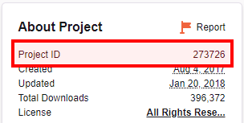
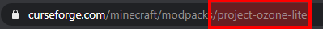

# CurseForge Modpack Downloader

## Download your favourite modpacks without Twitch app!

For some reasons you don't want to download this Twitch application to get some modpacks. Maybe like me you hate it. Maybe like me you must retry several times before Twitch app will download your modpack.  
Worry no more, because here you got
## **CURSEFORGE MODPACK DOWLOADER, HELL YEA**
> Warning: If you are so afraid of cmd, better go away from here. Here you got something with [GUI written in Java](https://github.com/Vazkii/CMPDL), I don't know how it works, use at your own responsibility. Maybe I will add some GUI to this project later

## Usage
### Using Project ID
Find the project ID on the modpack's CurseForge page.



Open your terminal/cmd, enter the directory when you want to download modpack and type `cmpdl <project id>`

For example, [Project Ozone Lite (https://www.curseforge.com/minecraft/modpacks/project-ozone-lite)](https://www.curseforge.com/minecraft/modpacks/project-ozone-lite)
```bash
    cmpdl 273726
```

### Using Project Name/Slug
Or you can try using the project name taken from modpack url, but this method is slower and not always successful. 

  

Now just open your terminal/cmd, enter the directory when you want to download modpack and type `cmpdl <project name>`

For example, [Project Ozone Lite (https://www.curseforge.com/minecraft/modpacks/project-ozone-lite)](https://www.curseforge.com/minecraft/modpacks/project-ozone-lite)
```bash
    cmpdl project-ozone-light
```

# Installation
## Install node with npm for your operating system from [here](https://nodejs.org/en/)
And then run this command. Voilà it's installed
```bash
    npm install -g curse-modpack-downloader
```

## License
MIT